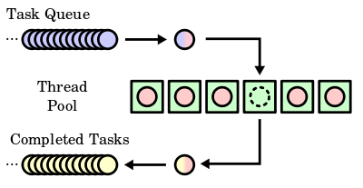
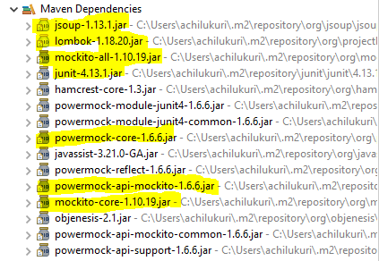

# Web Crawler Application
Java based web-crawler program for non-concurrent and concurrent environments.
## Context
A Small java application which lets us to crawl websites concurrently using multi-threading (WebCrawler.java) AND non-concurrent one (SampleWebCrawler.java) in Java.

## Approach taken
Web crawling is an intensive task, especially when it involves multilevel links on huge websites, however the task does not involve complex computations. Given that java provides multi-threaded program execution inside JVM we can make use of the various ExecutorServices available under `java.util.concurrent` package. 
- Given that the multi-threading is a great power it obviously comes with a responsibility of optimally using the resources, such as sharable thread resources, the execution environment and the processing overheads. In order to make use of resources optimally, I have chosen the FixedThreadPool approach where the Threads are put back to the pool once their task gets completed.

- Making use of the FunctionalInterface paradigm available under `java.util.function` package to leverage Async processing in the way that javascript's promises work eg. `java.util.function.BiConsumer` to make obtain the response when the entire crawling process is completed in an asyc ways such that there is no wait in the main thread to synchronously wait after calling the `CrawlerService.crawlSite(<>)` method.
- Configurable depth and ability to crawl external sites or sites with different domain origin added as references in the given site.
- jsoup to handle HTML parsing. 
- Junit & Mockito and PowerMockito for mock based Unit Testing.

## Dependencies
Following are the dependent libraries that are used by the crawler application.

## Tests
Following are the list of Unit tests and Integration tests that I have added as part of the application development.

>         Developed in Spring STS IDE

## Running the app
I have created a runnable jar archive that lets us use the application. 

### build
`mvn clean install`

### run
`java -jar buildit-web-crawler-0.0.1-SNAPSHOT.jar "http://wiprodigital.com" 3`

#Note: The jar file runs the multi-threaded "WebCrawler.java" class and prints the lists of urls crawled. User have an option to run "SampleWebCrawler.java" as well with passing parameter manually

`java -cp buildit-web-crawler-0.0.1-SNAPSHOT.jar com.buildit.assignment.SampleWebCrawler "http://wiprodigital.com"`

## References
- web document loading using jsoup : https://www.mkyong.com/java/jsoup-basic-web-crawler-example/

